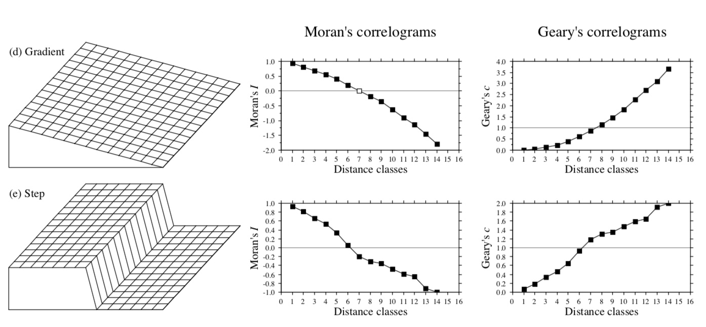

```{r setup, echo = F}
knitr::opts_chunk$set(
  comment = "#",
  collapse = TRUE,
  warning = FALSE,
  message = FALSE,
  cache = FALSE,
  fig.width=6, fig.height=6,
  fig.align = 'center'
)

# Export to pdf
#--------------
# library(webshot)
# file_name <- paste0("file://", normalizePath("Variogram.html"))
# webshot(file_name, "Variogram.pdf")
#--------------
# or
#--------------
#pagedown::chrome_print("Variogram.rmd")
```

<!-------------->

##### Spatial (or temporal) correlation may be described by <sup>1</sup>

* **Correlograms**

A correlogram is a graph in which *spatial correlation* values are plotted, on the ordinate, against *distance classes* among sites on the abscissa.

* **Variograms** (semi-variograms)

A variogram is a graph in which *semi-variance* is plotted, on the ordinate, against *distance classes* among sites on the abscissa

* **Periodograms** (structure assumed to consist of *a combination of sine waves*)

Fit sines and cosines of various periods, one period at a time, and determine the proportion of the series’ variance $(R^2)$ explained by each period. The abscissa is either a period or its inverse, a frequency; the ordinate is the proportion of variance explained. 

.footnote[

[1] Legendre, P. and Legendre, L. (2012). *Numerical Ecology, 3rd English edition.* Elsevier.

]

---

class: center, middle

## Principle

```{r, echo=FALSE}

knitr::include_graphics("images/principe.jpeg")

```

---

class: center

##### Correlograms


```{r, out.width=450, echo=FALSE}


```

.left[

.pull-left[
* **Moran’s I**

Moran’s I related to the *Pearson correlation* coefficient. *Usually* takes values between –1 and +1

**Numerator** : *covariance*; 

**Denominator** : maximum-likelihood estimator of the *variance*

]

.pull-right[

* **Geary’s c**

Geary’s c coefficient is a *distance-type* function : varies from 0 to some unspecified value larger than 1.

**Numerator** : sums the squared differences

.alert[Varies as the reverse of a Moran’s I correlogram]

]

]

---

class: center

##### Correlograms


```{r, out.width=450, echo=FALSE}


```

&nbsp;

*Positive spatial correlation : positive values of I.*

*Negative correlation : negative values.*

$\Rightarrow$ **Strong spatial correlation produces high values of I and low values of c**

.alert[Sensitive to extreme values and asymmetry in distribution : normalize data]

---

class: center

##### Absence of auto-correlation : **Moran’s I** = $0$ & **Geary’s c** = $1$

```{r, out.width=500, echo=FALSE}




```

---

class:center, middle

### Correlograms

```{r, out.width=500, echo=FALSE}


```

&nbsp;

### Semi-variograms

```{r, out.width=500, echo=FALSE}


```


$\Rightarrow$ **Numerator of Geary’s c**


---

class: center

### Semi-variograms

```{r, out.width=500, echo=FALSE}


```

.left[

* *sill* : variance of the variable
* *range* :  beyond that distance, the sampling units are not spatially correlated
* $C_0$ (*nugget effect*) : local variation occurring at scales finer than the sampling interval
  * ex : sampling error, fine-scale spatial variability, and measurement error
* $C_1$ : spatially structured component
]

---

class: center, middle

## Example

```{r, echo=FALSE}


```

---

class: center, middle

#### Fit models to the sample variogram (kriging)

```{r, echo=FALSE}


```

---

class: center

## Computation in R

.left[

### Autocorrelation

```{r, eval=FALSE}

acf(x, lag.max = NULL, type = c("correlation", "covariance", 
    "partial"), plot = TRUE, na.action = na.fail...)

```

### Cross-correlation/cross-variogram

```{r, eval=FALSE}

ccf(x, y, lag.max = NULL, type = c("correlation", "covariance"), 
    plot = TRUE, na.action = na.fail, ...)

```

]

---

class: center

#### Monthly Deaths from Lung Diseases in the UK, 1974–1979

.pull-left[
```{r, out.width=300}
acf(ldeaths, 
    type = "correlation")
```
]


.pull-right[
```{r, out.width=300}
acf(ldeaths, 
    type = "covariance")
```
]

---

class: center

#### Covariation male/female

.pull-left[
```{r, out.width=300}
ccf(mdeaths, fdeaths, 
    type = "correlation", 
    ylab="cross-correlation")
```
]

.pull-right[
```{r, out.width=300}
ccf(mdeaths, fdeaths, 
    type = "covariance", 
    ylab="cross-variation")
```
]


---

## Another example from marine systems <sup>2</sup>

```{r, out.width=600, echo=FALSE}


```

.footnote[

[2] Lessin, G., Bruggeman, J., McNeill, C. L., and Widdicombe, S. (2019). Time scales of benthic macrofaunal response to pelagic production differ between major feeding groups. *Frontiers in Marine Science*, 6:15.

]


---

class: center, middle

# Other approaches (MEM)

---

class: center

#### Principle

MEM<sup>3</sup> (Moran's eigenvector maps): spatial variables representing structures of all relevent scales

*Geographic distances among sites* or *spatial weighting matrix* $\Rightarrow$ **spatial explanatory variables**

&nbsp;

```{r, out.width = 600, echo=FALSE}


```

.footnote[

[3] Dray, S., Legendre, P., and Peres-Neto, P. R. (2006). Spatial modelling: a comprehensive framework for principal coordinate analysis of neighbour matrices (PCNM). Ecological Modelling, 196(3):483 – 493.

]

---

class: center

#### Examples <sup>4</sup>

&nbsp;

.pull-left[
```{r, out.height="400px",dpi=800, echo=FALSE}


```
]

.pull-right[
```{r, out.height="400px",dpi=800,echo=FALSE}


```
]

.footnote[

[4] Borcard, D., Gillet, F., & Legendre, P. (2018). Numerical ecology with R. 2nd edition. Springer.

]

---

class:center, middle

MEM and dbMEM can be computed using [adespatial](https://cran.r-project.org/web/packages/adespatial/vignettes/tutorial.html)

.pull-left[
.left[
```{r mem_ex, warning = FALSE, message = FALSE, eval=FALSE}

library(adespatial)
library(adegraphics)

# Generate grid point coordinates
xygrid2 <- expand.grid(1:5, 1:5)

# Creation of the dbMEM eigenfunctions with non-null Moran's I 
xygrid2.dbmem.tmp <- 
  dbmem(xygrid2,MEM.autocor="non-null")

xygrid2.dbmem <- 
  as.data.frame(xygrid2.dbmem.tmp)

# Plot some dbMEM variables using s.value {adegraphics} 
somedbmem2 <- c(1:20) 
s.value(xygrid2, 
        xygrid2.dbmem[,somedbmem2],
  method = "color",
  symbol = "circle",
  ppoints.cex = 0.5
)

```
]
]

.pull-right[
```{r mem_ex-out, out.width = 550, warning = FALSE, message = FALSE, ref.label="mem_ex", echo=FALSE}
```
]


---

class:center, middle

### Analyse de codépendance

```{r,echo=FALSE}


```

---

class:center, middle

### Analyse de codépendance

.pull-left[
```{r, out.height="400px",dpi=800, echo=FALSE}


```
]

.pull-right[
```{r, out.height="400px",dpi=800,echo=FALSE}


```
]